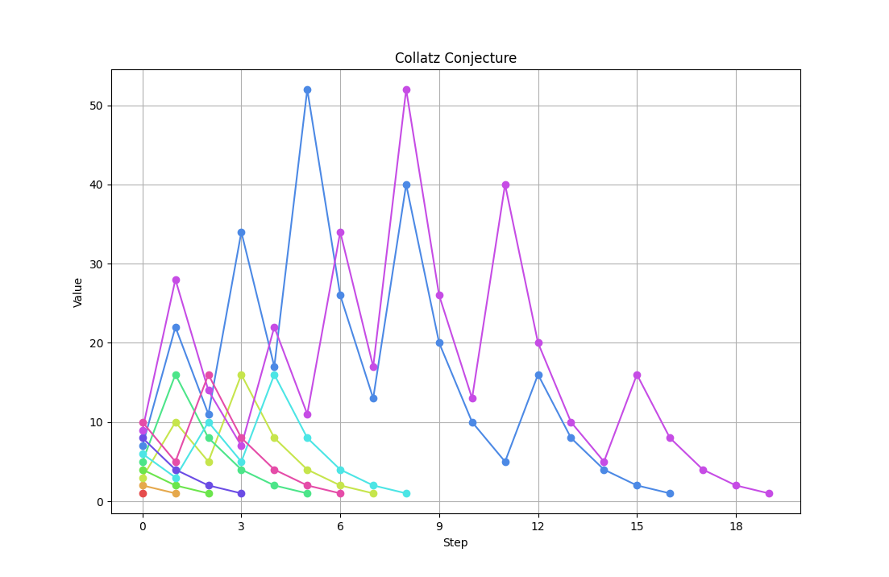

# W4_6
The mathematical problem, Collatz Conjecture, is described in the following [video](https://youtu.be/094y1Z2wpJg).

Also at the [wikipedia](https://en.wikipedia.org/wiki/Collatz_conjecture)



Create a program which prompts the user to insert an integer and then display the collatz conjecture as shown in the examples below.

Run 1
````
Program starting.
Insert a positive integer: 10
10 -> 5 -> 16 -> 8 -> 4 -> 2 -> 1
Sequence had 6 total steps.

Program ending.
````

Run 2
````
Program starting.
Insert a positive integer: 6
6 -> 3 -> 10 -> 5 -> 16 -> 8 -> 4 -> 2 -> 1
Sequence had 8 total steps.

Program ending.
````

Run 3
````
Program starting.
Insert a positive integer: 7
7 -> 22 -> 11 -> 34 -> 17 -> 52 -> 26 -> 13 -> 40 -> 20 -> 10 -> 5 -> 16 -> 8 -> 4 -> 2 -> 1
Sequence had 16 total steps.

Program ending.
````

Run 4
````
Program starting.
Insert a positive integer: 7
7 -> 22 -> 11 -> 34 -> 17 -> 52 -> 26 -> 13 -> 40 -> 20 -> 10 -> 5 -> 16 -> 8 -> 4 -> 2 -> 1
Sequence had 16 total steps.

Program ending.
````
